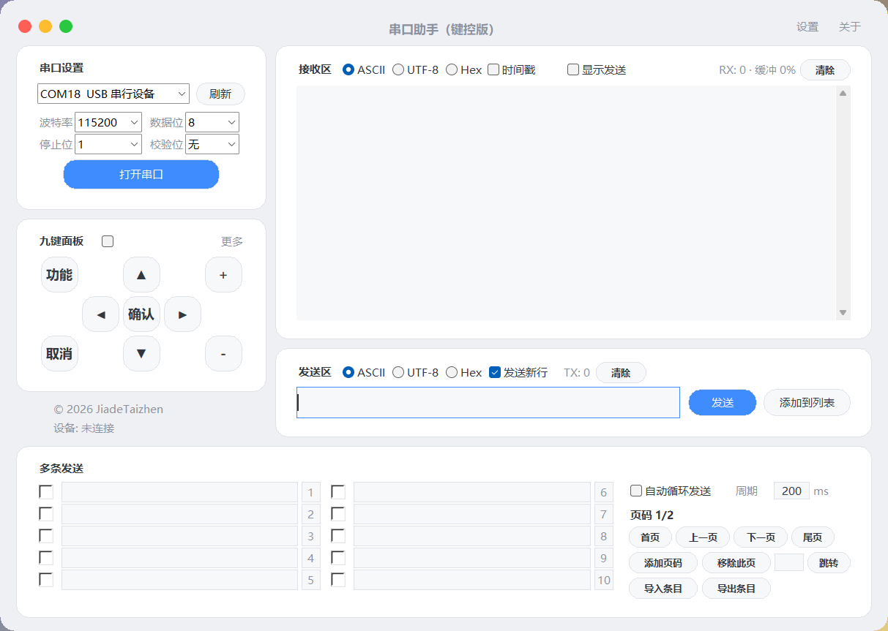
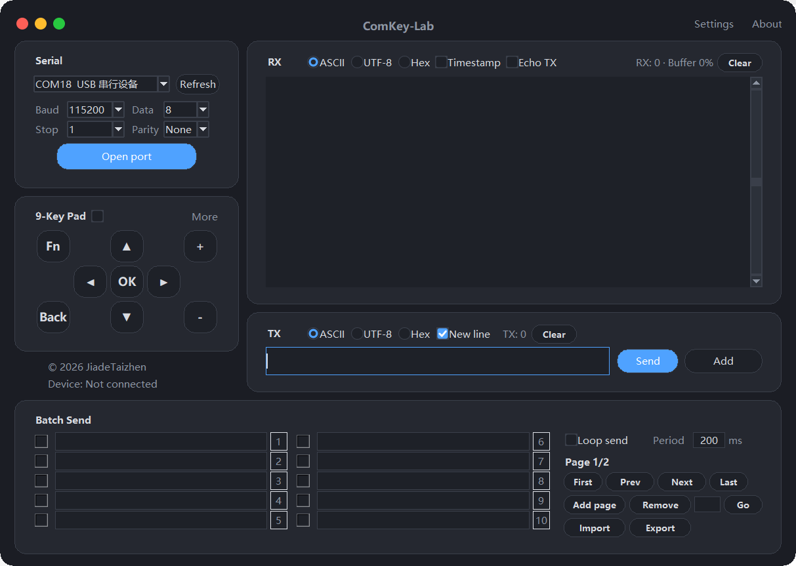
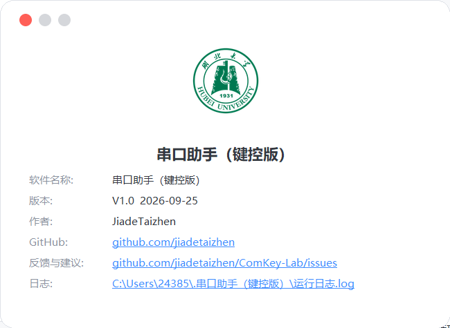

# 串口助手（键控版）

- 发行版下载：**Releases → `ComKey-Lab-V1.0` → `ComKey-Lab-V1.0.exe`**（约 8.0 MB，免安装，双击运行）
  它就是「串口助手（键控版）.exe」，GitHub 的发行文件不接受中文文件名所以用英文名挂出，下载后改不改名都能用；仓库根目录里那份保留中文名。
- 运行环境：Windows 10 / 11（64 位），**不需要安装 Python**
- 反馈：https://github.com/jiadetaizhen/ComKey-Lab/issues

## 界面一览

**主界面 · 白天（中文）** —— 左栏是串口设置与九键面板，中栏是接收区 / 发送区，右下是十条可勾选的多条发送；标题栏右侧两个入口是「设置」和「关于」。

**主界面 · 夜间（English）** —— 同一套界面切到夜间配色与英文。配色、语言都在「设置」里热切换，不用重启，窗口位置和你填过的端口、条目都不动。

**设置面板**（点标题栏「设置」弹出）

- **语言**：中文 / English 互切，界面文字当场换，不重建窗口。
- **外观**：白天 / 夜间两套配色（夜间按 VSCode 那套深色）。
- **接收显示**：勾上「ASCII 与 Hex 同时显示」后，每条数据下面补一行十六进制，收到的原文与字节一并列出。
- **缓冲上限**：预览最多保留多少内容（200K ~ 5M，按字符数计），超出后从最旧的一行开始整批丢弃；接收区右上角实时显示 `RX: 字节数 · 缓冲 占用%`。

**关于面板**（点标题栏「关于」弹出）—— 软件名称、版本、作者，以及三行可以直接点的链接：GitHub 主页、反馈与建议（打开本仓库 issues）、日志（用记事本打开运行日志）。

---

## 三步跑通

1. **接线**：板子 USB 串口线接电脑 → 设备管理器里能看到 COM 口（CH340 芯片需要装一次驱动）。
2. **连接**：打开软件 → 左侧「串口设置」选端口 → 波特率选 **115200**（与配套板端固件一致）→ 点「打开串口」，底部状态变成「已连接」。
3. **开键控**：勾上「九键面板」标题行最左边的小方框。**勾上之前**键盘按键不会发出去，此时它就是一个普通串口助手；勾上之后，焦点在主窗口时按键盘即可操控板子。

每收到一帧校验通过的指令，板端会回送一帧 `55 C3 ...` 作为确认，接收区里能看到——这是判断"板子真的收到了"最直接的依据。

---

## 键盘 → 板端按键对照（九个键）

| 板端按键 | 键盘按键 | 说明 |
| --- | --- | --- |
| 上 | `↑` | 菜单上移、数值加 |
| 下 | `↓` | 菜单下移、数值减 |
| 左 | `←` | 等同实体「取消 / 返回」，退回上层 |
| 右 | `→` | 等同实体「确认」，进入或选择菜单项 |
| 确认 | `Enter` / 小键盘 `Enter` | |
| 取消 | `Esc` | |
| 功能 | `左Ctrl` / `右Ctrl` | 不产生按键事件，触发板端**软复位** |
| 加 | `+` / `=` / 小键盘 `+` | 等同「上」，数值调节与菜单翻页共用 |
| 减 | `-` / 小键盘 `-` | 等同「下」 |

- **长按**：按住 800 毫秒判定为长按。
- **连发**：上 / 下 / 左 / 右 / 加 / 减 长按之后，每 150 毫秒自动再发一次（数值调节不用一直点）。板端只有"上 / 下"两路有连发语义，左 / 右 的连发帧会被忽略。
- 鼠标点「九键面板」上的九个按钮，效果与按键盘完全一样。
- 焦点在输入框或下拉框里时，方向键归输入框自己用，不会被抢走；要控板子，点一下窗口空白处即可。

---

## 通讯协议（表里的数值全部是十六进制）

一条指令固定 4 个字节，依次是：`55`、`A3`、`CMD`、`SUM`。

- `55 A3` 帧头。
- `CMD` 指令：高 4 位是动作，低 4 位是键号。
  - 动作：`0` 短按、`1` 按下、`2` 释放、`3` 长按、`4` 连发。
  - 键号：`0` 上、`1` 下、`2` 确认、`3` 取消、`4` 功能、`5` 加、`6` 减、`7` 左、`8` 右。
- `SUM` 校验：`SUM ＝ F6 XOR CMD`，其中 XOR 为按位异或，`F6` 由帧头 `55` 与 `A3` 异或得到。板端据此判定后续内容是一条按键指令。
- 板端正确接收后回送一帧 `55 C3 ...` 作为确认。

举例：`上-短按` 发出 `55 A3 00 F6`；`右-连发` 发出 `55 A3 48 BE`。
软件里点标题栏「更多」可以看到九键 × 五种事件的完整报文对照表。

---

## 界面分区

- **左栏 · 串口设置**：串口设备 + 刷新、波特率（常用档位 + 「自定义」，自定义可填 30~4000000，填超了会自动钳到边界，不弹窗）、数据位 / 停止位 / 校验位、打开 / 关闭串口。
- **左栏 · 九键面板**：标题行最左边的小方框是键控开关；下面是九个按键按钮，鼠标点一下和按键盘发的是同一帧。
- **中栏 · 接收区 / 发送区**：两栏标题行从左到右是「编码三选一（ASCII / UTF-8 / Hex）→ 时间戳 → 显示发送 → RX 计数 → 清除」和「编码三选一 → 发送新行 → TX 计数 → 清除」，两栏第一列对齐；清除会把对应的计数一起归零。发送区支持自动循环发送（可设周期 ms）。
- **右栏 · 多条发送**：一页 10 个条目，每条可以自己写内容、勾是否启用、点行号单发；支持添加页码 / 移除此页 / 首页 上一页 下一页 尾页 / 导入条目 / 导出条目，页签文字和端口、波特率一起存进配置。
- **标题栏**：软件名、「设置」「关于」「更多」三个入口，右边是最小化与关闭。窗口四边和四个角都能自由拖动缩放。
- **页脚**：版权文字可点击，打开作者 GitHub 主页。

---

## 设置与热切换

「设置」面板里的四项都是**当场生效、当场存盘**：切换语言和配色时界面不重建、不闪原生窗口，你挪过的弹窗位置和层级保持不变；改缓冲上限会立刻按新上限裁一次预览。这些设置与端口、波特率、多条发送的页签内容一起写进 `配置.json`，下次启动自动恢复。

---

## 运行日志与配置

- 日志**只记关键事件**：启动、退出、串口打开 / 关闭、串口打开失败、界面回调异常、未捕获异常，以及界面被卡住超过 5 秒（恢复时补记一行）。收发的数据、按键事件一律不写。
- 位置：`用户目录\.串口助手（键控版）\运行日志.log`。超过 64 KB 自动裁到最后 32 KB，不会无限变大。
- 点「关于」面板里的**日志**一行（蓝色下划线），直接用记事本打开这个文件。
- 端口、波特率、九键页签文字保存在同目录的 `配置.json`，退出时写入、下次启动自动恢复。

---

## 常见问题

| 现象 | 排查 |
| --- | --- |
| 端口列表里没有 / 打不开串口 | 线没插好或驱动没装；端口被其他串口工具占用（同一个 COM 口只能被一个程序打开），插拔后点「刷新」 |
| 按键盘板子没反应 | ① 有没有勾选键控开关；② 焦点是不是在主窗口（不在输入框里）；③ 两端波特率是否都是 115200；④ 板子是否已上电并烧有配套固件；⑤ 接收区有没有 `55 C3` 应答帧 |
| 接收区里混着看不懂的英文句子 | 正常。板端的调试打印和按键指令共用同一路串口；勾「十六进制」可以看到原始帧 |
| 中文显示成乱码 | 接收区按 GB2312 / GBK 解码；板端若用其它编码打印，切到十六进制看 |
| 双击 EXE 被 Windows 拦下 | 未做代码签名，SmartScreen 提示时点「更多信息 → 仍要运行」；个别杀毒软件会拦未签名程序，加白名单即可 |
| 界面卡住 | 见上面「运行日志」，卡住超过 5 秒会留一行记录 |

---

## 版本

当前发行：**V1.0**（标题栏「关于」里显示的就是这个号）。
本仓库只放发行版（EXE + 使用说明）。
